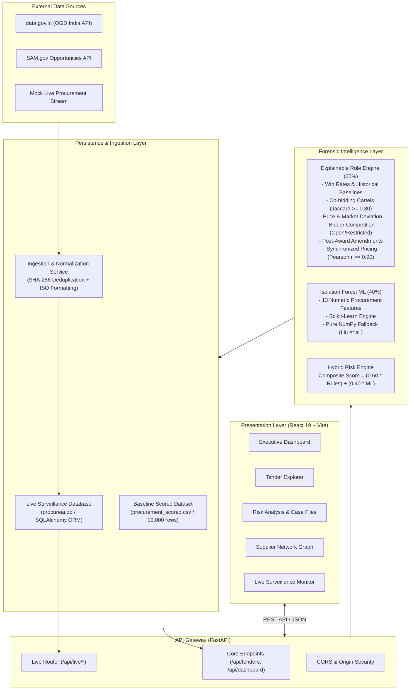
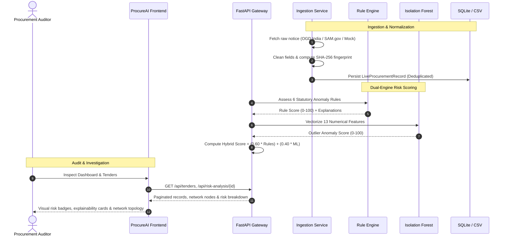

# ProcureAI

> **AI-Powered Public Procurement Risk Intelligence & Forensic Surveillance Platform**

[](https://fastapi.tiangolo.com)
[](https://react.dev)
[](https://python.org)
[](https://scikit-learn.org)
[](https://www.sqlite.org)
[](LICENSE)

---

## Executive Summary

Public procurement accounts for approximately **12% to 15% of global GDP** (over $13 trillion annually). According to the OECD and United Nations Office on Drugs and Crime (UNODC), an estimated **10% to 25% of public contract value is lost to corruption, fraud, and collusive bid-rigging**. 

Traditional procurement oversight relies on manual, retrospective sample audits conducted months or years after public funds have already been disbursed. **ProcureAI** transforms public sector oversight from reactive auditing into **real-time forensic surveillance**. By synthesizing explainable rule-based heuristics with multi-dimensional Isolation Forest machine learning, ProcureAI screens tenders, analyzes supplier networks, and flags collusive bidding cartels before contract awards are finalized.

---

## Problem Statement

Public procurement tenders are vulnerable to six systemic anti-competitive patterns:

1. **Vendor Contract Monopolization**: Favored contractors win contracts repeatedly with statistically improbable historical win rates exceeding category baselines.
2. **Collusive Co-Bidding Rings**: Coordinated supplier cartels repeatedly bid against one another across regional tenders to create the illusion of genuine market competition (cover bidding / bid rotation).
3. **Price Benchmark Distortion**: Bid proposals and contract awards deviate drastically from estimated market benchmarks and engineering baseline values.
4. **Suppressed Competition**: Solicitations receive suspiciously few bids (often 1 or 2) due to restrictive specifications, short notice windows, or deliberate bidder exclusion.
5. **Post-Award Value Escalation**: Lowball bids are submitted to secure contract wins, followed by aggressive change orders and amendments that expand contract payouts by 20% to 100%+.
6. **Synchronized Bid Pricing Margins**: Supposedly independent bidding vendors submit proposals with suspiciously correlated pricing structures (Pearson correlation $r \ge 0.90$), indicating shared bid preparation.

---

## The ProcureAI Solution

ProcureAI delivers an end-to-end intelligence gateway that continuously monitors procurement solicitations:

- **Dual-Engine Hybrid Scoring**: Combines **60% Explainable Rule Heuristics** with **40% Isolation Forest Machine Learning** into a normalized $0\text{--}100$ composite risk index.
- **Explainable Anomaly Attribution**: Every flagged tender includes granular, auditable explanations detailing exactly which statutory thresholds were breached and why.
- **Supplier Link Topology & Cartel Detection**: Visualizes corporate networks, co-bidding frequencies, and shared tender relationships to expose hidden supplier cartels.
- **Decoupled Real-Time Surveillance (RT Subsystem)**: Connects to live public procurement data streams (e.g. Open Government Data Platform India, US SAM.gov, and local authorities) using SHA-256 fingerprint deduplication and defensive data adaptation.

---

## Key Features

| Capability | Technical Description |
| :--- | :--- |
| **Executive Intelligence Dashboard** | Real-time surveillance overview displaying monitored tenders, high-risk counts, estimated exposure values at risk, monthly risk trends, and recent anomaly alert feeds. |
| **Forensic Tender Explorer** | High-performance search and multi-criteria filtering across 10,000+ tenders by sector, risk level, status, or keyword with sub-5ms in-memory query indexing. |
| **Explainable Risk Case Files** | Detailed forensic dossiers breaking down composite scores into individual rule contributions, Isolation Forest outlier metrics, and procurement audit timelines. |
| **Supplier Network Topology** | Interactive node-link graph mapping supplier relationships, co-bidding connections, subcontract loops, and cartel clusters. |
| **Hybrid Risk Engine (60 / 40)** | Weighted ensemble combining domain heuristics with 13-feature multidimensional anomaly detection. Includes a zero-dependency pure NumPy Isolation Forest fallback. |
| **Live Procurement Monitoring** | Streaming ingestion architecture capable of polling official government REST APIs, normalizing heterogeneous payloads, and persisting assessments in SQLite. |
| **Automated Audit Dossiers** | Generates standardized investigation summaries and procedural recommendation logs for internal audit teams and oversight authorities. |

---

## System Architecture



---

## How It Works: Forensic Workflow



---

## AI & Risk Scoring Engine: Technical Deep Dive

### 1. The 6 Explainable Heuristic Rules

Each rule evaluates a specific procurement fraud typology, returning an activation flag, weighted score, and transparent natural-language audit reason.

| Rule Name | Weight | Condition & Threshold | Domain Rationale |
| :--- | :---: | :--- | :--- |
| **High Vendor Win Rate** | **20.0** | $\text{participations} \ge 5$ and $\text{win\_rate} > 65\%$ | Detects entrenched vendor favoritism and sole-source steering while respecting strict temporal boundaries. |
| **Repeated Co-Bidders** | **20.0** | Shared tenders $\ge 3$, 24-month lookback, $\text{Jaccard} \ge 0.80$ | Identifies collusive bidder clusters that repeatedly bid together across tenders. |
| **Abnormal Pricing** | **20.0** | $\frac{\text{Bid}}{\text{Market}} > 1.35$ or $< 0.55$, or $\frac{\text{Bid}}{\text{Tender}} > 1.25$ | Detects severe budget misallocations, contract inflation, or unviable predatory pricing. |
| **Low Bidder Competition** | **15.0** | $\text{Open} \le 2$ bidders, or $\text{Restricted} \le 1$ bidder | Flags artificial competition barriers, restricted specifications, or inadequate public notice. |
| **Post-Award Escalation** | **15.0** | $\frac{\text{Final Value} - \text{Award Value}}{\text{Award Value}} \times 100 > 20.0\%$ | Flags lowball bids submitted with the pre-arranged intent to recover margins via change orders. |
| **Similar Bidding Patterns** | **10.0** | Co-bids $\ge 3$, Pearson correlation $r \ge 0.90$ | Catches price synchronization where competitor pricing moves in locked lockstep. |

$$\text{Rule Score} = \min\left(100.0, \sum_{i=1}^{6} \text{Score}(\text{Rule}_i)\right)$$

### 2. Multidimensional Isolation Forest (ML Layer)

The machine learning engine identifies multidimensional numerical outliers that evade isolated threshold checks:

- **13 Feature Vectors**: `num_bidders`, `tender_value`, `estimated_market_value`, `bid_amount`, `award_value`, `final_contract_value`, `contract_duration_months`, `previous_participations`, `previous_wins`, `vendor_win_rate`, `post_award_change_pct`, `bid_to_tender_ratio`, `bid_to_market_ratio`.
- **Pre-processing**: Missing value imputation, robust float casting, and MinMax feature normalization.
- **Dual Engine Fallback**: Uses `scikit-learn`'s `IsolationForest` when available. If native C-extensions or compilation libraries are missing, ProcureAI automatically falls back to an internal **Pure NumPy Isolation Forest** implementation based on Liu et al. (2008).
- **Output**: Normalized anomaly score from $0.0$ to $100.0$.

### 3. Composite Risk Index & Categorization

$$\text{Final Risk Score} = \left(0.60 \times \text{Rule Score}\right) + \left(0.40 \times \text{ML Anomaly Score}\right)$$

Tenders are categorized into four standardized audit tiers:

$$\text{Risk Level} = \begin{cases} 
\text{LOW} & \text{if } \text{Score} < 20 \\
\text{MODERATE} & \text{if } 20 \le \text{Score} < 40 \\
\text{HIGH} & \text{if } 40 \le \text{Score} < 70 \\
\text{CRITICAL} & \text{if } \text{Score} \ge 70 
\end{cases}$$

- **Investigation Status**: Any solicitation with $\text{Final Risk Score} \ge 20.0$ or $\text{Rule Score} \ge 20.0$ is designated as **`REQUIRES INVESTIGATION`**; otherwise, it is classified as **`LOW PRIORITY`**.

---

## Data Sources & Ingestion Subsystems

ProcureAI supports both high-volume historical audits and real-time live streaming surveillance:

### 1. Historical Baseline Dataset
- **Volume**: 10,000 fully scored solicitations (`procurement_scored.csv`).
- **Sectors Covered**: IT Services, Construction, Medical Supplies, Transport, and Management Consulting.
- **Temporal Integrity**: Chronologically ordered tenders with historical participation records calculated strictly prior to tender dates (zero future-leakage).

### 2. Live Surveillance Feeds
- **Mock Live Stream (`mock_live_source.py`)**: Deterministic stream simulating tenders with realistic supplier identities, multi-sector categories, and edge-case bidding scenarios.
- **OGD Platform India (`ogd_india_source.py`)**: Official REST connector for the Indian Open Government Data Platform (`data.gov.in`) adhering to National Data Sharing and Accessibility Policy (NDSAP) standards.
- **US SAM.gov Opportunities (`sam_gov_source.py`)**: Official REST connector for federal government contract opportunities.
- **Data Normalization (`data_normalizer.py`)**: Sanitizes strings, parses currency formats (INR Crore/Lakh, USD), standardizes ISO-8601 dates, and calculates SHA-256 record hashes to prevent duplicate database ingestion.

---

## Technology Stack

| Layer | Technologies | Description |
| :--- | :--- | :--- |
| **Frontend Framework** | **React 19, Vite 8** | High-performance reactive user interface with fast HMR and sub-second build times. |
| **Routing & Navigation** | **React Router DOM 7** | Client-side routing with deep-link state management. |
| **Visualization & Icons** | **Recharts 3, Lucide React** | Dynamic charts (Area, Donut, Bar, Network) and comprehensive SVG iconography. |
| **Styling & Design** | **Modern CSS3 & Vanilla Tokens** | Custom dark/light responsive design system, tailored metrics badges, and glassmorphism panels. |
| **Backend Gateway** | **FastAPI 0.110, Uvicorn 0.28** | Asynchronous Python REST API with automatic OpenAPI documentation. |
| **Data Science & ML** | **NumPy 1.24+, Pandas 2.0+, SciPy, Scikit-learn** | High-speed array operations, feature scaling, and Isolation Forest algorithms. |
| **Persistence** | **SQLite 3, SQLAlchemy 2.0** | Lightweight, zero-config relational storage for live surveillance records. |

---

## Project Structure

```text
procureai/
├── backend/
│   ├── data_sources/              # Ingestion adapters
│   │   ├── base.py                # Abstract BaseDataSource contract
│   │   ├── mock_live_source.py    # Deterministic live stream generator
│   │   ├── ogd_india_source.py    # data.gov.in official REST connector
│   │   └── sam_gov_source.py      # SAM.gov Opportunities API connector
│   ├── database/                  # Relational persistence
│   │   ├── database.py            # SQLAlchemy engine & session factory
│   │   ├── init_db.py             # Schema initialization utility
│   │   ├── models.py              # LiveProcurementRecord & LiveRiskAssessment ORM models
│   │   └── procureai.db           # Local SQLite database file (gitignored)
│   ├── routes/                    # API route controllers
│   │   ├── __init__.py
│   │   └── live.py                # Live surveillance endpoints (/api/live/*)
│   ├── services/                  # Business logic & ingestion pipeline
│   │   ├── data_normalizer.py     # Schema mapping, currency parsing, SHA-256 deduplication
│   │   ├── ingestion_service.py   # Batch fetch, deduplication, and staging
│   │   ├── live_risk_processing.py# Defensive execution of risk engine on live records
│   │   └── risk_adapter.py        # Maps raw JSON payloads to rule parameters
│   ├── anomaly_model.py           # Isolation Forest model & feature preparation
│   ├── anomaly_rules.py           # 6 Explainable statutory heuristic rules
│   ├── bidder_patterns.py         # Jaccard similarity & Pearson co-bidding correlation
│   ├── main.py                    # Offline batch pipeline (dataset generation & scoring)
│   ├── preprocess.py              # Data cleansing and ratio calculations
│   ├── procurement_dataset.csv    # Raw baseline dataset (10,000 tenders)
│   ├── procurement_scored.csv     # Pre-computed scored baseline dataset
│   ├── pure_isolation_forest.py   # Zero-dependency NumPy Isolation Forest fallback
│   ├── requirements.txt           # Python dependency definitions
│   ├── risk_engine.py             # 60/40 Hybrid composite risk aggregator
│   ├── server.py                  # FastAPI intelligence gateway entrypoint
│   └── .env.example               # Backend configuration template
│
├── frontend/
│   ├── public/                    # Static assets & brand icons
│   ├── src/
│   │   ├── components/            # Reusable UI components
│   │   │   ├── common/            # StatCard, Badge, Button, SearchInput
│   │   │   ├── layout/            # AppShell, Sidebar, Header, Navigation
│   │   │   └── tenders/           # TenderTable, DetailDrawer, RiskMeter
│   │   ├── pages/                 # Forensic application views
│   │   │   ├── DashboardPage.jsx            # Executive surveillance overview
│   │   │   ├── TenderExplorerPage.jsx       # Search & multi-filter tender table
│   │   │   ├── RiskAnalysisPage.jsx         # Case file review & explainability cards
│   │   │   ├── SupplierNetworkPage.jsx      # Interactive cartel link topology
│   │   │   ├── InvestigationReportsPage.jsx # Audit dossier generation & export
│   │   │   └── LiveMonitoringPage.jsx       # Real-time streaming surveillance
│   │   ├── services/              # API client integration (api.js)
│   │   ├── styles/                # Design tokens & component styling
│   │   ├── App.jsx                # Route definitions & application shell
│   │   └── main.jsx               # React DOM entrypoint
│   ├── index.html                 # HTML application template
│   ├── package.json               # Node.js dependencies & scripts
│   ├── vite.config.js             # Vite configuration with /api backend proxy
│   └── .env.example               # Frontend configuration template
│
├── .gitignore                     # Workspace root gitignore
└── README.md                      # Project documentation
```

---

## Installation & Setup Guide

### Prerequisites
- **Python 3.10+** (with `pip` and virtual environment support)
- **Node.js 18.0+** and **npm**

---

### Step 1: Backend Setup

1. Open a terminal and navigate to the backend directory:
   ```bash
   cd backend
   ```

2. Create and activate a Python virtual environment:
   ```bash
   # On Windows (PowerShell)
   python -m venv .venv
   .\.venv\Scripts\Activate.ps1

   # On Linux/macOS
   python3 -m venv .venv
   source .venv/bin/activate
   ```

3. Install required Python packages:
   ```bash
   pip install -r requirements.txt
   ```

4. Configure the environment:
   ```bash
   cp .env.example .env
   ```
   *(Optional: Add your `DATA_GOV_IN_API_KEY` in `.env` if testing live external Indian government feeds).*

5. Initialize the SQLite surveillance database:
   ```bash
   python -m database.init_db
   ```

6. Verify that the pre-scored baseline dataset is present:
   ```bash
   # If procurement_scored.csv is missing, generate and score it:
   python main.py
   ```

7. Start the FastAPI backend server:
   ```bash
   uvicorn server:app --reload --host 0.0.0.0 --port 8000
   ```
   *The API will be available at `http://localhost:8000`. Interactive Swagger API docs are accessible at `http://localhost:8000/docs`.*

---

### Step 2: Frontend Setup

1. Open a new terminal and navigate to the frontend directory:
   ```bash
   cd frontend
   ```

2. Install Node.js dependencies:
   ```bash
   npm install
   ```

3. Configure the environment:
   ```bash
   cp .env.example .env
   ```
   *Note: In local development, the Vite dev server automatically proxies `/api` requests to `http://127.0.0.1:8000`, so `VITE_API_BASE_URL` can remain empty.*

4. Launch the frontend development server:
   ```bash
   npm run dev
   ```
   *The web application will open at `http://localhost:5173`.*

---

## Environment Variables Reference

### Backend Configuration (`backend/.env`)

| Variable | Default | Purpose |
| :--- | :--- | :--- |
| `HOST` | `0.0.0.0` | Network binding interface. |
| `PORT` | `8000` | HTTP port for the FastAPI gateway. |
| `ALLOWED_ORIGINS` | `http://localhost:5173,http://127.0.0.1:5173` | Comma-separated list of authorized CORS origins. |
| `DATA_PATH` | `./procurement_scored.csv` | Filepath to the scored historical procurement CSV dataset. |
| `DATABASE_PATH` | `./database/procureai.db` | Filepath to the SQLite database. |
| `PROCUREAI_LIVE_SOURCE` | `ogd_india` | Active live source mode (`mock`, `ogd_india`, or `sam_gov`). |
| `DATA_GOV_IN_API_KEY` | *(Empty)* | API Key for Open Government Data Platform India (`data.gov.in`). |
| `DATA_GOV_IN_RESOURCE_ID`| *(Empty)* | Target procurement catalog resource UUID on `data.gov.in`. |
| `DATA_GOV_IN_BASE_URL` | `https://api.data.gov.in/resource` | Base endpoint for the OGD Platform API. |
| `SAM_GOV_API_KEY` | *(Empty)* | API Key for US Federal Contract Opportunities (`api.sam.gov`). |

### Frontend Configuration (`frontend/.env`)

| Variable | Default | Purpose |
| :--- | :--- | :--- |
| `VITE_API_BASE_URL` | *(Empty)* | Leave empty when running behind Vite's dev proxy or an Nginx reverse proxy. Set to `https://api.domain.com` for cross-origin split deployments. |

---

## API Reference Overview

All responses return standard JSON. Interactive documentation is automatically available at `/docs` (Swagger UI) and `/redoc` (ReDoc).

| HTTP Method | Path | Summary / Description |
| :--- | :--- | :--- |
| `GET` | `/api/health` | Service health status, version, and loaded dataset record count. |
| `GET` | `/api/dashboard/overview` | Executive KPI metrics, monthly risk trends, sector distributions, top anomalies. |
| `GET` | `/api/tenders` | Paginated tender records with query filtering (`search`, `category`, `risk_level`, `status`, `page`, `limit`). |
| `GET` | `/api/tenders/high-risk` | Filtered list of all tenders meeting High or Critical risk criteria. |
| `GET` | `/api/tenders/{tender_id}` | Detailed data drawer payload for an individual tender solicitation. |
| `GET` | `/api/risk-analysis/{tender_id}` | Complete explainable risk case file with factor breakdown, rule reasons, and audit timeline. |
| `GET` | `/api/supplier-network` | Node-link supplier graph, collusion ring indicators, and network signals. |
| `GET` | `/api/live/dashboard` | Live SQLite database surveillance metrics and count breakdown. |
| `GET` | `/api/live/tenders` | Paginated live notices stored in SQLite with assessment linkage. |
| `GET` | `/api/live/tenders/{id}` | Single live tender notice by database ID, tender reference, or external ID. |
| `GET` | `/api/live/assessments` | Persisted risk assessments from live ingestion streams. |

---

## User Interface & Screenshots

### 1. Executive Intelligence Dashboard
*Comprehensive high-level oversight displaying active solicitations, total exposure value at risk, category distribution donuts, and live anomaly streams.*
```
+-----------------------------------------------------------------------------------------+
| [ProcureAI]   Overview   Tender Explorer   Risk Analysis   Supplier Network   Live Feed |
+-----------------------------------------------------------------------------------------+
|  [ Total Monitored: 10,000 ]   [ High-Risk: 1,482 ]   [ Value at Risk: ₹428.5 Cr ]      |
+----------------------------------------------------+------------------------------------+
|  Monthly Risk Detection Trend                      | Sector Risk Distribution           |
|  [ / \  /\  Risk Signals (High)                    | [### Construction (42%) ]          |
|  [---\-/--\ Suspicious Tenders                     | [##  Transport    (28%) ]          |
+----------------------------------------------------+------------------------------------+
|  Top High-Risk Solicitations Flagged For Audit Review                                   |
|  * T00412 - Transport Fleet Expansion | Apex Civil Ltd | Risk: 88.4/100 (CRITICAL)       |
|  * T00891 - Hospital Diagnostic Units  | BioMed Alliance| Risk: 76.2/100 (HIGH)           |
+-----------------------------------------------------------------------------------------+
```
*(Screenshot placeholder: `docs/screenshots/dashboard.png`)*

### 2. Forensic Tender Explorer
*Full-text search, sector filtering, and status categorization allowing auditors to drill into any solicitation instantly.*
*(Screenshot placeholder: `docs/screenshots/tender_explorer.png`)*

### 3. Explainable Risk Case File
*Transparent factor attribution showing exact rule trigger mechanics, Isolation Forest score, and step-by-step procurement audit timeline.*
*(Screenshot placeholder: `docs/screenshots/risk_analysis.png`)*

### 4. Interactive Supplier Network Graph
*Node-link relational topology identifying shared tender bids, suspicious co-bidding cartels, and cover-bidding loops.*
*(Screenshot placeholder: `docs/screenshots/supplier_network.png`)*

### 5. Live Procurement Surveillance Stream
*Real-time monitoring feed displaying incoming government tenders ingested via REST APIs, tracking normalization status and automated assessments.*
*(Screenshot placeholder: `docs/screenshots/live_monitoring.png`)*

---

## Future Enhancements

1. **Graph Neural Networks (GNNs)**: Implement relational Graph Convolutional Networks (GCNs) over supplier co-bidding graphs for automated cartel ring classification.
2. **Automated Bid Document NLP**: Extract uncompressed metadata and analyze linguistic similarity across submitted PDF technical specifications to detect shared authorship.
3. **Cross-Jurisdiction Sanctions Screening**: Automatically cross-reference corporate officers and beneficial owners against global sanctions and debarment lists (e.g. World Bank, OFAC).
4. **Automated Audit Memo Synthesis**: Generate PDF/Word compliance audit dossiers populated with evidentiary data points for judicial enforcement proceedings.
5. **Webhook Alerting**: Real-time webhook notifications dispatching High/Critical anomaly alerts directly to Slack, Microsoft Teams, or case management systems.

---

## Team & Hackathon Information

| Name | Role | Responsibilities |
| :--- | :--- | :--- |
| **Dinesh Karthik** | *Lead Architect & Full-Stack Engineer* | System architecture, FastAPI gateway, React frontend, and UI design system. |
| **Teammate (ML & AI)** | *Machine Learning Engineer* | Isolation Forest integration, feature normalization, and pure NumPy fallback. |
| **Teammate (Data & Rules)**| *Forensic Data Analyst* | Explainable rule heuristics, temporal integrity verification, and dataset generation. |

---

## License

This project is licensed under the **MIT License** — see the [LICENSE](LICENSE) file for details.
